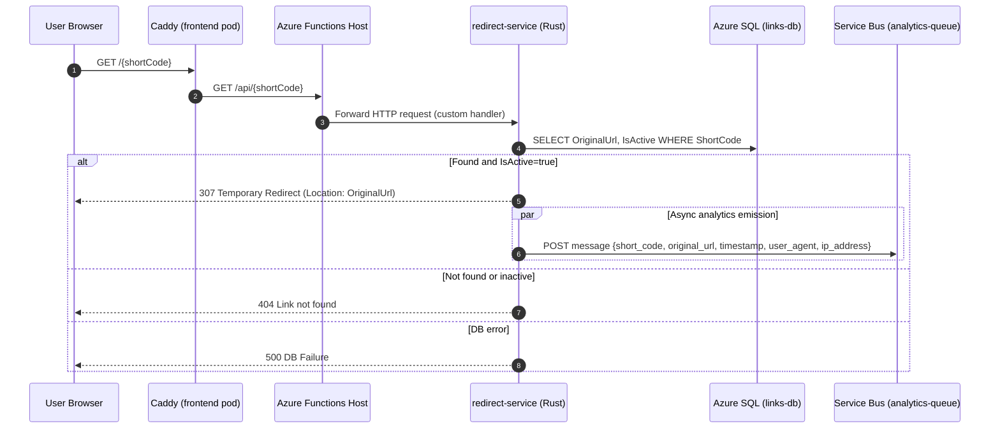
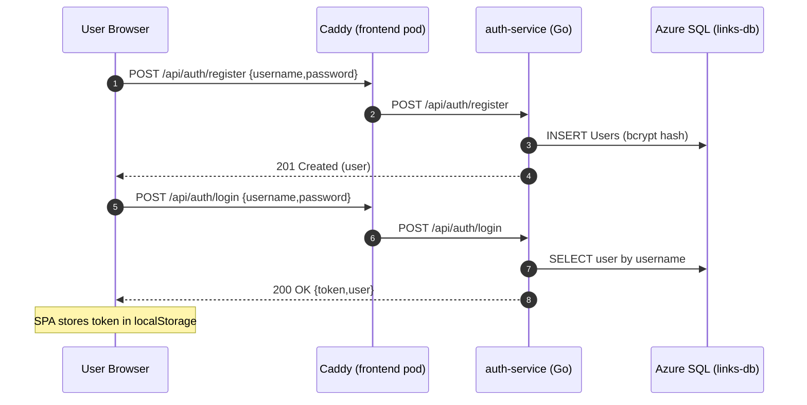
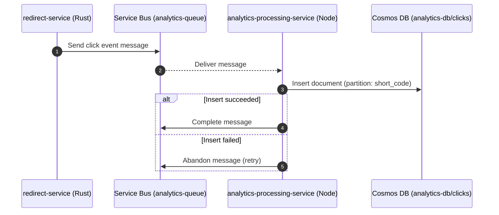
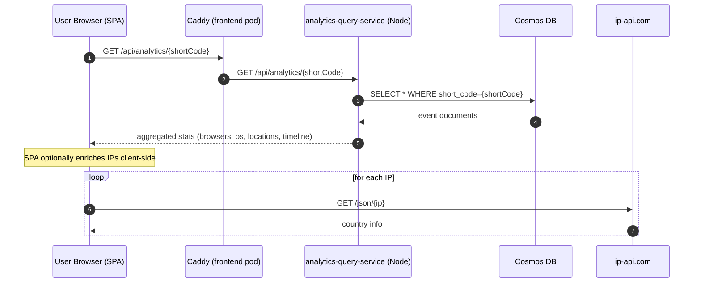
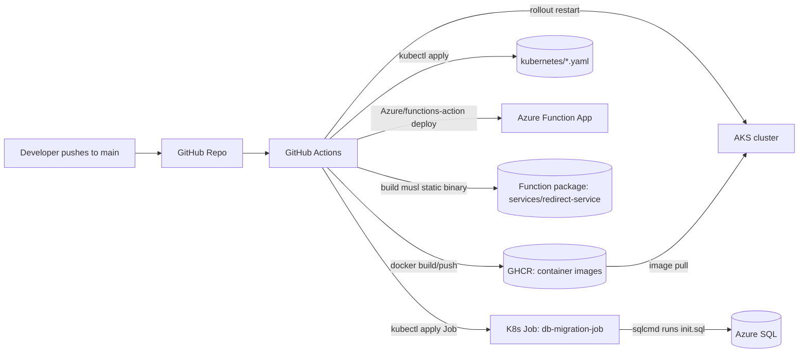
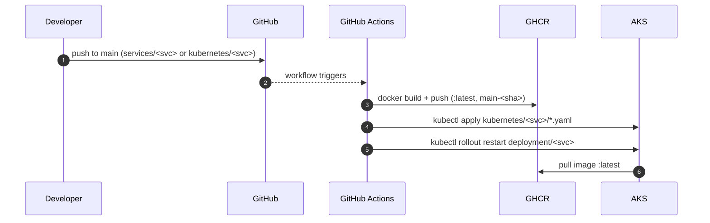
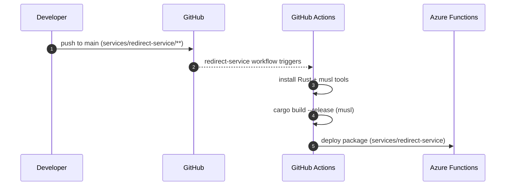

# ARCHITECTURE_DIAGRAM

This file contains Mermaid diagrams that represent the entire codebase architecture.

Notes:

- The **public edge** is Caddy inside the `frontend` pod (AKS). It serves SPA assets and routes requests.
- Azure Functions HTTP triggers default to the `/api` prefix; the redirect function trigger route is `{short_code}`.
- `local-dep/` is intentionally omitted from diagrams because it is unused in the current cloud deployment.

---

## 1) System component diagram

```mermaid
flowchart TD
  %% External
  U[User Browser]

  %% Public edge
  subgraph AKS[Azure Kubernetes Service (AKS)]
    subgraph FE[frontend pod]
      C[Caddy (TLS + reverse proxy + static SPA)]
      SPA[Vue SPA (static assets)]
    end

    AS[auth-service (Go/Gin)]
    LMS[link-management-service (Go/Gin)]
    AQS[analytics-query-service (Node/Express)]
    APS[analytics-processing-service (Node worker)]
  end

  subgraph Azure[Azure Managed Services]
    SQL[(Azure SQL: links-db)]
    SB[(Azure Service Bus: analytics-queue)]
    COSMOS[(Cosmos DB: analytics-db/clicks)]
    KV[(Key Vault: SqlConnectionString + ServiceBusConnection)]
    SA[(Storage Account: AzureWebJobsStorage)]
  end

  subgraph Func[Azure Functions]
    F[redirect-service (Rust custom handler)]
  end

  %% User -> edge
  U -->|HTTPS 443| C
  C -->|serves| SPA

  %% API routing (Caddy)
  C -->|/api/auth/*| AS
  C -->|/api/links/*| LMS
  C -->|/api/analytics/*| AQS

  %% Short links
  C -->|rewrite /{code} -> /api/{code}| F

  %% Data dependencies
  AS --> SQL
  LMS --> SQL

  %% Redirect dependencies
  F -->|lookup ShortCode| SQL
  F -->|enqueue click event| SB

  %% Analytics pipeline
  APS -->|receive| SB
  APS -->|write click docs| COSMOS
  AQS -->|query + aggregate| COSMOS

  %% App configuration
  F -. KeyVault refs .-> KV
  F -. storage binding .-> SA

  %% Optional integration
  SPA -. IP geolocation (client-side) .-> IPAPI[(ip-api.com)]
```

---

## 2) Redirect (hot path) sequence



---

## 3) Auth (register + login) sequence



---

## 4) Link creation / update / delete sequence

```mermaid
sequenceDiagram
  autonumber
  participant Browser as User Browser
  participant Caddy as Caddy (frontend pod)
  participant Links as link-management-service (Go)
  participant SQL as Azure SQL (links-db)
  participant Func as redirect-service (Azure Function)

  %% Create (guest or user)
  Browser->>Caddy: POST /api/links {originalUrl, customAlias?}
  Caddy->>Links: POST /api/links

  alt No Authorization header
    Note over Links: Treated as Guest; customAlias rejected
    Links->>SQL: INSERT Links (ExpiresAt=now+24h)
    Links-->>Browser: 201 Created (link)
  else Has JWT
    Note over Links: Extract sub (userID) and role
    Links->>SQL: INSERT Links (quota checks)
    Links-->>Browser: 201 Created (link)
  end

  %% Update (requires JWT)
  Browser->>Caddy: PUT /api/links/{shortCode} {originalUrl} (Authorization: Bearer)
  Caddy->>Links: PUT /api/links/{shortCode}
  Links->>SQL: SELECT link by ShortCode
  Links->>SQL: UPDATE Links SET OriginalUrl
  Links-->>Browser: 200 OK (updated link)
  Note over Links: Also attempts async cache eviction via DELETE {CACHE_EVICTION_URL}/{shortCode}

  %% Delete (requires JWT)
  Browser->>Caddy: DELETE /api/links/{shortCode} (Authorization: Bearer)
  Caddy->>Links: DELETE /api/links/{shortCode}
  Links->>SQL: SELECT link by ShortCode
  Links->>SQL: DELETE FROM Links
  Links-->>Browser: 200 OK
  Note over Links: Also attempts async cache eviction

  Note over Func: Current Rust redirect service does not expose /api/cache in this repo.
```

---

## 5) Analytics processing (async path) sequence



---

## 6) Analytics query + frontend enrichment sequence



---

## 7) CI/CD delivery diagram (GitHub Actions)



---

## 8) CI/CD sequence (AKS services)



---

## 9) CI/CD sequence (redirect-service Azure Functions)


